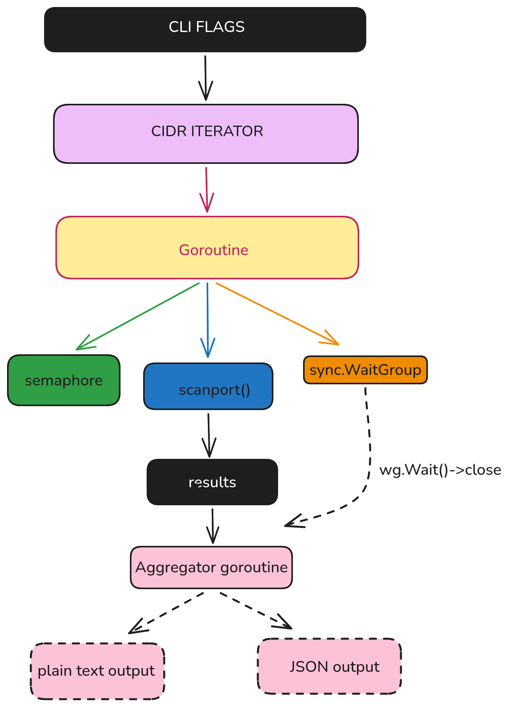

# cli-network-scanner

A fast, concurrent TCP port scanner written in Go.It demonstrates goroutine-based concurrency, semaphore rate-limiting, and clean CLI design.

---

## Architecture



---

## Features

- **Concurrent scanning** — configurable goroutine pool with semaphore back-pressure
- **CIDR range support** — scan any IPv4 subnet (e.g. `10.0.0.0/24`)
- **Port range** — specify start and end port
- **Reverse DNS** — resolves hostnames for open ports automatically
- **JSON output** — machine-readable results via `--json` flag
- **Sorted results** — output is always in lexicographic order

---

## Usage

```bash
# Build
go build -o scanner .

# Scan a single host, ports 1–1024
./scanner --cidr 45.33.32.156/32 --start 1 --end 1024

# Scan a /24 subnet, top 100 ports, 1000 concurrent goroutines
./scanner --cidr 192.168.1.0/24 --start 1 --end 100 --concurrency 1000

# JSON output (pipe into jq, save to file, etc.)
./scanner --cidr 10.0.0.0/28 --start 80 --end 8080 --json | jq .
```

---

## Flags

| Flag | Default | Description |
|------|---------|-------------|
| `--cidr` | `45.33.32.156/32` | Target IP range in CIDR notation |
| `--start` | `80` | First port to scan |
| `--end` | `85` | Last port to scan |
| `--concurrency` | `500` | Max simultaneous goroutines |
| `--json` | `false` | Output results as JSON array |

---

## Example Output

**Plain text**
```
Scanning 45.33.32.156/32 from 1 to 1024...

--- Scan Results ---
[+] 45.33.32.156:22 is open (scanme.nmap.org)
[+] 45.33.32.156:80 is open (scanme.nmap.org)
```

**JSON mode**
```json
[
  "45.33.32.156:22",
  "45.33.32.156:80"
]
```

---

## Design Notes

**Semaphore pattern** — a buffered channel of empty structs (`chan struct{}`) is the idiomatic Go semaphore. Sending blocks when full; receiving (deferred) releases the slot. Cheaper than `sync.Mutex` for rate-limiting goroutine entry.

**Unbuffered results channel** — the collector goroutine is launched before scanning begins, draining the channel as goroutines write. Avoids accumulating an unbounded buffer of strings in memory.

**Timeout** — `net.DialTimeout` with 500 ms keeps total scan time predictable. Lower values increase speed but increase false negatives on slow hosts.

**Sorted output** — `sort.Strings` on `ip:port` strings gives consistent, diffable output.

---

## What I Learned

- Goroutine lifecycle management with `sync.WaitGroup`
- Semaphore-based concurrency throttling with buffered channels
- `netip` package for zero-allocation IP address arithmetic
- Channel fan-in pattern (many writers, one reader)
- CLI design with the `flag` package

---


## Requirements

Go 1.21+ (uses `net/netip`)

---

> **Legal** — Only scan hosts you own or have explicit written permission to scan.
